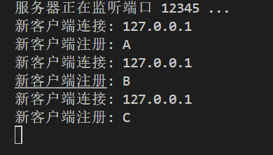
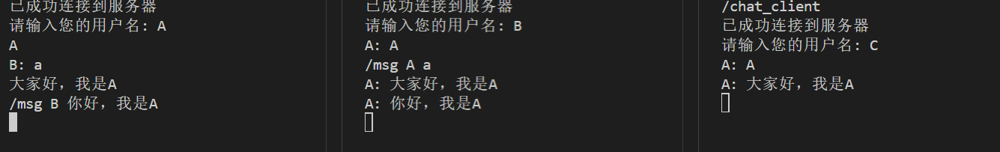
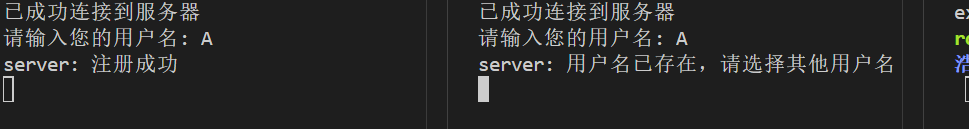

# 聊天程序设计报告

## 1. 协议设计
### 1.1 消息类型
该聊天程序的协议设计包括多种消息类型，用于支持多种聊天功能：
- **CONNECT (0)**：用于客户端注册用户名的连接消息。
- **DISCONNECT (1)**：用于客户端断开连接的消息。
- **BROADCAST (2)**：群聊消息，广播给所有已连接的客户端。
- **PRIVATE (3)**：私聊消息，发送给特定的客户端。
- **SERVER_NOTICE (4)**：服务器通知，用于向客户端发送各种通知信息。

### 1.2 消息格式
消息的格式设计为：
```
<消息类型> | <发送者> | <接收者> | <消息内容>
```
各字段的含义如下：
- **消息类型**：用于区分消息的用途，例如连接请求、群聊、私聊等。
- **发送者**：表示发送该消息的用户。
- **接收者**：指定接收消息的目标用户。
- **消息内容**：包含聊天的具体内容或注册信息等。

### 1.3 协议语义与时序
- **连接建立**：客户端启动后首先通过 CONNECT 消息向服务器注册用户名，服务器会将该用户名与客户端的套接字进行关联。
- **消息发送**：
  - 群聊消息使用 BROADCAST 类型，服务器将其转发给所有已连接的客户端。
  - 私聊消息使用 PRIVATE 类型，服务器通过用户名找到特定的客户端套接字进行转发。
- **断开连接**：客户端发送 DISCONNECT 消息，服务器在接收到该消息后，移除客户端并关闭其连接。

### 1.4 协议的完整性与创新性
该协议的设计保证了消息在服务器与客户端之间的传递具有明确的目的和操作类型。与传统 TCP 和 UDP 的协议不同，本协议通过应用层逻辑实现了更高层次的语义，支持用户间的群聊和私聊功能，并通过消息类型和字段简化了消息的解析过程，提升了消息传递的灵活性和扩展性。

## 2. 各模块功能
### 2.1 服务器端
#### 主要函数与核心代码展示
- **`main()` 函数**：
  - 创建服务器套接字，绑定端口并进入监听状态，等待客户端连接。
  - 接受到新的客户端连接时，创建一个新线程调用 `handle_client()` 函数进行处理。
- **`handle_client(int client_socket)` 函数**：
  - 处理客户端的消息，包括消息的接收、解析及根据消息类型进行相应操作。
  - 使用互斥锁 (`std::mutex`) 来确保多线程访问共享资源（`clients` 映射）时的线程安全。
- **锁的使用**：
  - 在客户端列表 (`clients`) 的增删查改操作中使用了互斥锁 (`clients_mutex`) 来防止竞态条件。
  
### 2.2 客户端
#### 主要函数与核心代码展示
- **`main()` 函数**：
  - 创建客户端套接字，连接到服务器。
  - 输入用户名并发送注册消息 (`CONNECT` 类型) 到服务器。
  - 启动一个独立的接收线程，通过 `receive_messages()` 函数处理来自服务器的消息。
- **`receive_messages(int client_socket)` 函数**：
  - 持续接收服务器的消息，并将其解码后输出到控制台。
- **私聊与群聊逻辑**：
  - 私聊消息通过 `/msg <接收者> <消息>` 格式输入，程序将其解析为 PRIVATE 类型消息并发送到服务器。
  - 群聊消息直接输入内容并发送为 BROADCAST 类型。

### 2.3 核心代码片段分析
- **注册用户名**：
  - 客户端在连接后首先发送用户名注册消息，确保服务器可以正确识别该客户端。(主要是为了实现私聊功能)
  ```cpp
  ChatMessage register_msg;
  register_msg.type = CONNECT;
  register_msg.sender = sender;
  register_msg.receiver = "server";
  register_msg.content = "注册用户名";
  send(client_socket, register_msg.encode().c_str(), register_msg.encode().length(), 0);
  ```
- **消息转发**：
  - 服务器根据消息类型决定是广播还是私聊，并利用客户端套接字进行消息的发送。
  ```cpp
  if (msg.type == BROADCAST) {
      for (const auto &client : clients) {
          if (client.first != client_socket) {
              send(client.first, buffer, bytes_received, 0);
          }
      }
  }
  ```

## 3. 程序界面展示及运行说明
### 3.1 运行说明
- **服务器端**：
  1. 运行服务器程序：
     ```sh
     ./chat_server
     ```
  2. 服务器会在指定端口上监听，等待客户端连接。
- **客户端**：
  1. 运行客户端程序：
     ```sh
     ./chat_client
     ```
  2. 输入用户名，完成注册。
  3. 输入消息即可与其他客户端进行群聊，或通过 `/msg <接收者> <消息>` 进行私聊。
  4. 输入 `exit` 断开连接。

### 3.2 运行截图
- **客户端连接成功后的界面**：
  

- **群聊运行效果**：
  

- **私聊运行效果**：
  


## 4. 实验过程中遇到的问题及分析
### 4.1 问题与解决方案
1. **用户名重复问题**：
   - **问题**：当多个客户端尝试使用相同的用户名时，服务器无法区分它们。
   - **解决方案**：为每个连接的客户端保持唯一的用户名，要求客户端输入唯一的用户名，服务器可以检测用户名是否已存在并通知客户端。
   

2. **线程安全问题**：
   - **问题**：在多个客户端同时发送消息时，服务器的客户端映射 (`clients`) 容易出现竞态条件。
   - **解决方案**：使用 `std::mutex` 锁来保护对 `clients` 映射的访问，保证数据一致性。

3. **消息解析错误**：
   - **问题**：在私聊消息解析时，由于输入格式不正确，导致消息解码失败。
   - **解决方案**：在客户端进行输入格式校验，确保私聊消息格式正确后再发送到服务器。
    
    
### 4.2 实验思考
- **多线程的合理性**：
  - 服务器采用多线程来处理每个客户端的连接，这样可以保证多个客户端之间的消息处理不会相互阻塞，提高了系统的并发性能。
- **协议设计的灵活性**：
  - 通过定义不同的消息类型，协议具有很好的扩展性，可以轻松添加其他功能，例如文件传输或群组管理。

